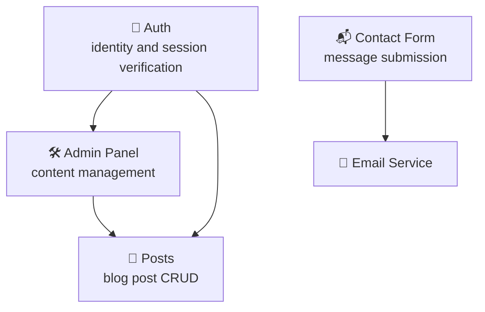

# AGENT.md — Template

You are a software development agent. This file must be read **before any other action**
when you operate in this repository.

## Onboarding — what to do before starting

### 1. Check ADR

Check whether the file `ADR.md` exists at the repository root.

**If ADR.md exists:**

- Read it in full before doing anything
- All code you write must respect the stack and constraints declared in the ADR
- Every new component must be consistent with the described architecture
- If the user asks for a feature that is not compatible with the ADR,
  warn them and ask for confirmation before proceeding

**If ADR.md does NOT exist:**

- Do not start writing code
- Read all available files in the repository (BRIEF.md, README.md, existing code)
- Ask the user for missing information (see the "Empty project" section below)
- Generate an ADR.md using the documented template and show it to the user for approval
- Wait for approval before proceeding with any development task

### 2. Check .specs/plans/

Check whether the `.specs/plans/` folder exists in the repository.

**If .specs/plans/ exists:**

- Read all `.md` files inside it
- These are planned development tasks and decision history
- Before starting a new task, verify it is not already planned in this folder

**If .specs/plans/ does NOT exist:**

- Create it when the first future feature is planned
- Each future feature gets its own file: `.specs/plans/feature-[name].md`

---

## Empty project — no existing code

If the repository has no code (only this AGENT.md or nothing), follow this flow:

### Step 1 — Gather requirements

Ask the user these questions, one at a time. Do not move to the next step
before getting an answer to the current one:

1. **What are you building?**
   Describe the product in 2-3 sentences. Who uses it? What problem does it solve?

2. **Who is it for?**
   Personal use, internal team, public users?

3. **What core features should it have?**
   Unordered list — do not worry about stack yet.

4. **Do you have stack constraints?**
   Preferred language, chosen framework, services to integrate?

5. **Where will it run in production?**
   VPS, cloud provider, local only?

6. **What should it NOT do (or not yet)?**
   Features explicitly excluded from the initial scope.

### Step 2 — Generate the ADR

Based on the answers, generate `ADR.md` using the standard template.
Show it to the user and ask: "Does this correctly reflect what you want to build?"

Do not proceed until the user approves the ADR - and make sure it follows exactly this structure:

```md

# Architecture Decision Record

**Project:** [derived from the Brief]
**Date:** [today]
**Author:** [leave blank — user fills this]

## Decision
[what was built — derive it from the Brief]

## Context
[why it was built and for whom — derive it from the Brief objective]

## Chosen platforms
- Frontend: [from Brief stack + codebase observation]
- Backend: [from Brief stack + codebase observation]
- Database: [from Brief stack + codebase observation]
- Deploy: [if not specified in Brief, write "undefined"]

## Main components
[derive from Brief components — one line per component, with a one-sentence responsibility]

## Architectural decisions
[for each stack choice in the Brief, write: implicit alternative vs chosen option — and reason if inferable from context]

## Constraints
[copy from Brief constraints, integrate with what you observe in code]

## What is NOT in scope
[copy from "negative constraints" and from the NO section in the Brief]

## Planned future features
[leave this section empty — it is filled together by me and the agent]

After generating ADR.md, tell me:
1. Which details you could not infer and I need to add manually
2. If you saw anything in code that was not in the Brief (implicit choices now made explicit)

```

### Step 2b — Generate the architecture diagram

After ADR approval, generate a file `architecture.mmd` with a Mermaid
diagram that visualizes components and dependencies. Example:



Adapt the diagram to the project's real components.

Then check whether `mmdc` (Mermaid CLI) is available:

```bash
which mmdc || npx --yes @mermaid-js/mermaid-cli --version
```

**If `mmdc` is installed:** run automatically:

```bash
mmdc -i architecture.mmd -o architecture.svg
```

and tell the user that `architecture.svg` was generated.

**If `mmdc` is NOT installed:** ask the user:

> "To generate the diagram as an image, I need Mermaid CLI (`mmdc`).
> I can install it with `npm install -g @mermaid-js/mermaid-cli` (requires Node.js).
> Do you want me to install it now, or would you rather view the diagram online
> at <https://mermaid.live> by pasting the content of `architecture.mmd`?"

Wait for their answer before continuing. If the user approves installation, run:

```bash
npm install -g @mermaid-js/mermaid-cli
mmdc -i architecture.mmd -o architecture.svg
```

### Step 3 — Break down into features

From the ADR, identify the main components. For each component, create a file
`.specs/plans/feature-[component-name].md` with this structure:

```markdown
# Feature: [Component Name]

## Objective
[Component responsibility in one sentence]

## Dependencies
[Which other components must exist first]

## Stack
[Technologies specific to this component — consistent with ADR]

## Expected output
[What should work when this feature is complete]

## Status
[ ] Not started
```

Show the list of files created. Ask the user: "Which feature do you want to start with?"

---

## Existing project — operational rules

### Stack and conventions

Read ADR.md for the declared stack. Do not introduce libraries or frameworks
not declared in ADR without asking explicitly.

### Architecture diagram

If `architecture.mmd` does not exist yet in the repository, generate it automatically
from ADR components and dependencies. Then check whether `mmdc` is available
(same logic as in the "Empty project" flow) and offer exporting it to SVG.

### Git workflow

- Do not work directly on `main`
- Each feature has its own branch: `feature/[name]` or `issue-[number]`
- Commit messages must follow: `type: short description (issue-N)`
  - `feat:` new feature
  - `fix:` bug fix
  - `docs:` documentation
  - `refactor:` refactoring without new features

### ADR updates

After each completed feature, check whether ADR needs updates:

- New dependency introduced → update "Chosen platforms"
- New constraint emerged → update "Constraints"
- Architectural choice made during development → update "Architectural decisions"
- Completed feature previously in "Planned future features" → move it to "Main components"

### .specs/plans/ updates

When a feature is complete:

- Update Status in `.specs/plans/feature-[name].md` to `[x] Completed`
- Add a line "Completed on: [date]" and "Notes: [any deviations from plan]"

---

## Instructions that never change

- Do not write code without reading ADR first (if it exists)
- Do not add features that were not explicitly requested
- Do not use libraries not declared in ADR without approval
- If a feature brief contradicts ADR, report it before executing
- Your main job is execution — architectural decisions belong to the developer
